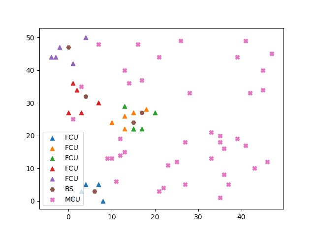
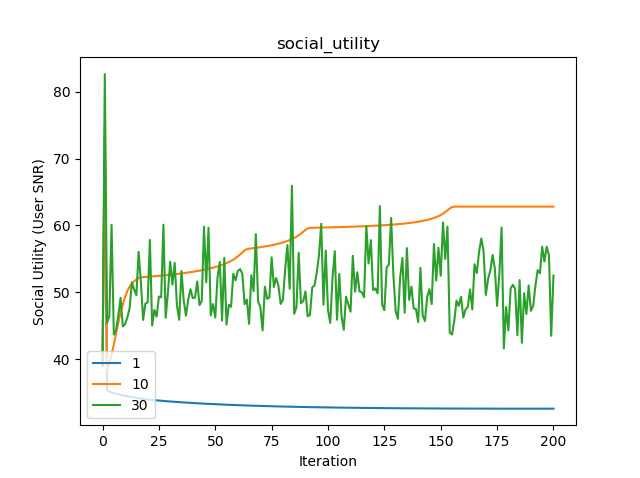

# Simulation Results and Descriptions

### Beamformer Comparison

Details: 5 users / basestation, 10 antenna / basestation, 40 macro users

### Increasing FCBS

Details: 2 users / basestation, 4 antenna / basestation, 20 macro users 

### increasing_power

### increasing_power with constraint

### increasing_macro_users

### Interference Constraint

