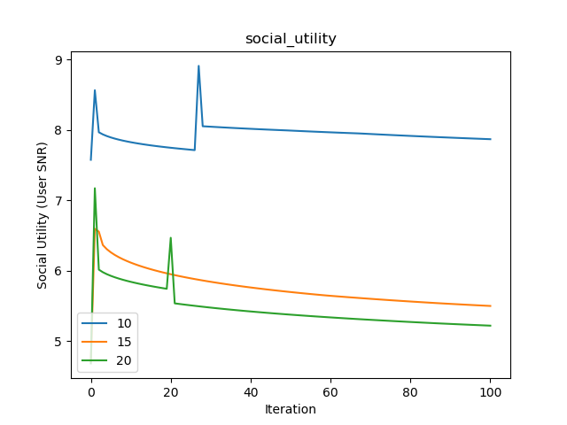
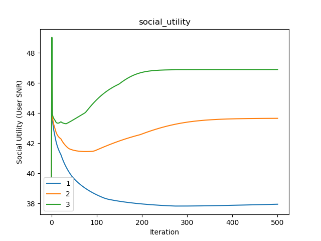
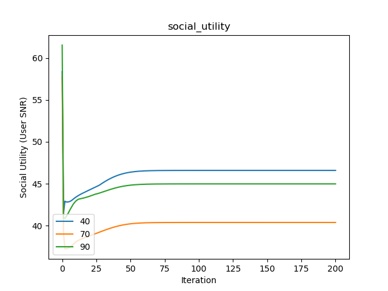
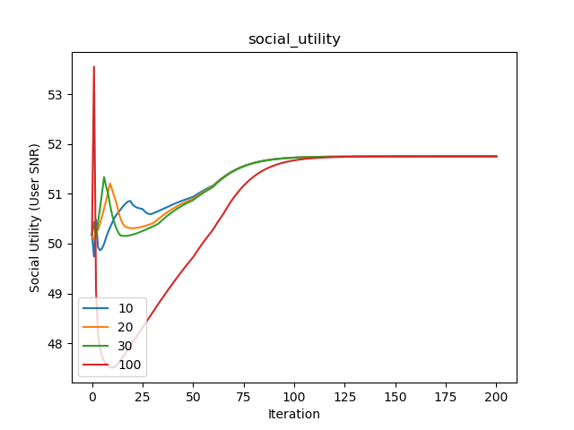

# Simulation Results and Descriptions

Details: 2 users / basestation, 4 antenna / basestation, 20 macro users (Original use)

Details: 2 users / basestation, 5 antenna / basestation, 40 macro users (Original use)

