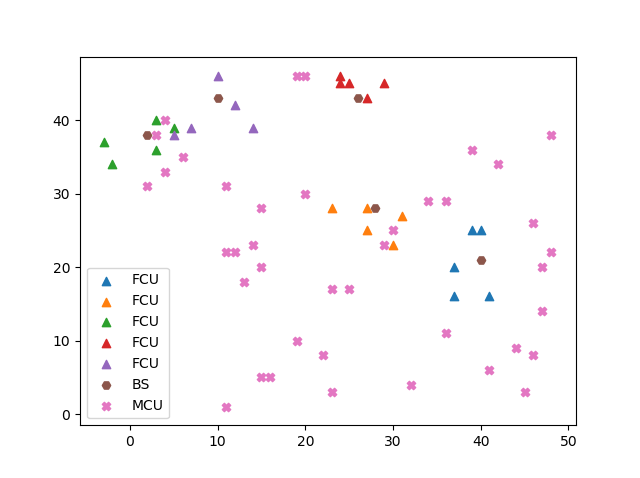
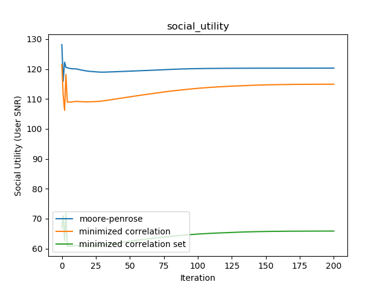

# Simulation Results and Descriptions

### Beamformer Comparison

Details: 2 users / basestation, 4 antenna / basestation, 20 macro users (Original use)

### Increasing FCBS

Details: 2 users / basestation, 4 antenna / basestation, 20 macro users (Original use)

### increasing_power

Details: 2 users / basestation, 5 antenna / basestation, 40 macro users (Original use)

### increasing_macro_users

### Interference Constraint

