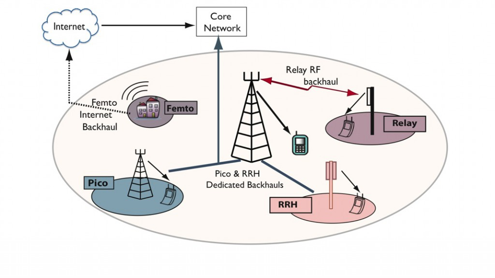

# Communication System Component Development and Testing framework

While the allocation strategies in this work are derived to apply to as general a situation as possible, the implementation and simulation of this work is focused on the so called Heterogenous Network. These are communication networks with uncoordinated users who may interfere with one another. The result is a game in which players are competing for the same resource to optimize their utility under system constraints.

## Illustration

